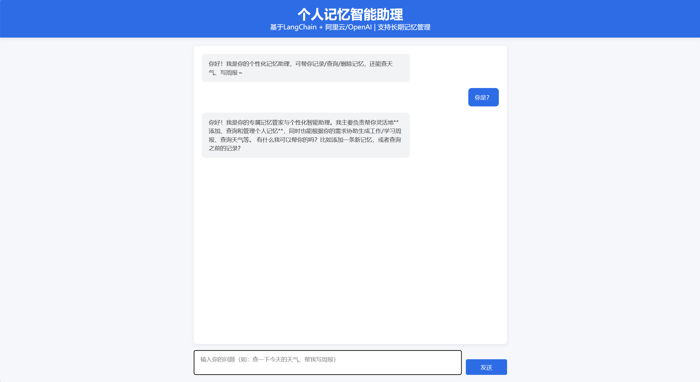

<div align="center">

# LangChain 个人记忆智能助理

### 用自然语言管理你的 AI 记忆 —— 一个上手即学的 LangChain Agent 实战项目

[](https://www.python.org/)
[](https://python.langchain.com/)
[](https://fastapi.tiangolo.com/)
[](https://www.trychroma.com/)
[](LICENSE)

</div>

<p align="center">
**[效果预览](#效果预览) · [快速开始](#快速开始) · [API Key 获取](#api-key-获取指南) · [项目结构](#项目结构)**
</p>

<p align="center">
  
</p>

---

## 为什么这个项目值得关注？

> 如果你正在学习 LangChain、想理解 Agent 是怎么工作的，或者想动手做一个带**长期记忆**的 AI 助理 —— 这个项目就是为你准备的。

- **从零到一**：两个递进式示例，从最简单的 Agent 到完整的全栈应用，循序渐进
- **真实可运行**：不是 demo 玩具，而是一个能真正管理记忆、查天气、写周报的实用助理
- **代码注释详尽**：核心代码逐行中文注释，每一处设计决策都有解释，不怕看不懂
- **完整日志输出**：INFO 级别日志覆盖全流程，运行过程一目了然，方便调试学习
- **免费即可运行**：阿里云通义千问新用户赠送大量免费 Tokens，零成本跑通整个项目
- **全栈架构**：FastAPI 后端 + 原生前端，不依赖复杂框架，初学者也能看懂

---

## 效果预览

你可以用自然语言与助理对话，它会**自动判断**该调用哪个工具：

| 你说的话 | Agent 的行为 |
|---------|-------------|
| `添加记忆：我家在上海，每天学习3小时` | 自动拆分，批量添加两条记忆 |
| `查询所有记忆` | 列出所有记忆（带序号） |
| `删除第1、3条记忆` | 按序号精准删除 |
| `批量删除和学习相关的记忆` | 按关键词批量删除 |
| `帮我查 Beijing 的天气` | 调用天气 API，返回实时天气 |
| `今天完成了后端部署，帮我写周报` | 结合记忆中的个性化信息，生成周报 |

> **提示**：天气查询时，城市名需要使用**拼音**（如 `Beijing、Shanghai`），不能使用中文。

---

## 技术栈

| 技术 | 版本 | 用途 |
|------|------|------|
| [Python](https://www.python.org/) | **3.12.5** | 运行环境 |
| [LangChain](https://python.langchain.com/) | 0.2.14 | Agent 框架、工具调用、记忆管理 |
| [阿里云通义千问](https://dashscope.aliyuncs.com/) | qwen3.6-plus | LLM 大模型 + Embedding |
| [ChromaDB](https://www.trychroma.com/) | 0.5.23 | 向量数据库，持久化存储用户记忆 |
| [FastAPI](https://fastapi.tiangolo.com/) | 0.135.1 | 后端 API 服务 |
| [HTML/CSS/JS](https://developer.mozilla.org/) | — | 前端聊天界面 |

---

## 快速开始

### 1. 克隆项目

```bash
git clone https://github.com/Siryecn/langchain-memory-agent.git
cd langchain-memory-agent
```

### 2. 创建虚拟环境

> 建议使用 **Python 3.12.5**，可从 [Python 官网](https://www.python.org/downloads/) 下载安装。
> 推荐使用 [PyCharm](https://www.jetbrains.com/pycharm/) 作为 IDE（社区版免费）。

```bash
python -m venv .venv

# Windows 激活
.venv\Scripts\activate

# macOS/Linux 激活
source .venv/bin/activate
```

### 3. 安装依赖

```bash
pip install -r requirements.txt
```

> 国内用户可添加镜像加速：
> ```bash
> pip install -r requirements.txt -i https://mirrors.aliyun.com/pypi/simple/
> ```

### 4. 配置 API Key

#### 项目 1（基础 Agent 示例）

API Key 直接写在 `1/agent.py` 代码中，运行前替换为你自己的密钥：

```python
# 1/agent.py 第 7-8 行
API_KEY1 = "your-openweathermap-api-key"   # OpenWeatherMap 天气 API Key
API_KEY2 = "your-dashscope-api-key"        # 阿里云 DashScope API Key
```

#### 项目 2（完整记忆助理系统）

在 `2/` 目录下创建 `.env` 文件（参考 `.env.example` 模板）：

```env
# 阿里云 DashScope 配置（必填）
OPENAI_API_KEY=your-dashscope-api-key
OPENAI_BASE_URL=https://dashscope.aliyuncs.com/compatible-mode/v1
OPENAI_MODEL_NAME=qwen3.6-plus
OPENAI_EMBEDDING_MODEL=text-embedding-v2

# 天气 API 配置（必填）
WEATHER_API_KEY=your-openweathermap-api-key

# 向量数据库配置（可选，有默认值）
CHROMA_PERSIST_DIR=./chroma_memory
VECTOR_SEARCH_K=3
VECTOR_SCORE_THRESHOLD=0.7
AGENT_MAX_ITERATIONS=50
AGENT_MAX_EXECUTION_TIME=60
LLM_TEMPERATURE=0.3
LLM_TIMEOUT=60
```

### 5. 运行项目

**项目 1 — 基础 Agent（命令行运行）：**

```bash
cd 1
python agent.py
```

**项目 2 — 完整记忆助理系统（前后端分离）：**

```bash
# 启动后端
cd 2
python main.py
```

服务启动后访问 `http://localhost:7000` 或直接打开 `2/index.html` 使用聊天界面。

---

## API Key 获取指南

> 两个 API Key 均可**免费注册**获取，个人学习零成本。

### 一、阿里云 DashScope API Key（必需）

用于调用通义千问大模型（qwen3.6-plus）和文本向量模型（text-embedding-v2）。

| 免费额度 | 说明 |
|---------|------|
| **100 万 Tokens** | 注册并完成实名认证即送，90 天有效 |
| **超 7000 万 Tokens** | 开通[百炼平台](https://bailian.console.aliyun.com)额外领取 |

**获取步骤：**

1. 访问 [阿里云官网](https://www.aliyun.com/)，注册账号并完成**实名认证**
2. 进入 [百炼大模型服务平台](https://bailian.console.aliyun.com)，点击开通
3. 左侧导航栏 → **「API-KEY 管理」** → **「创建 API Key」**
4. 复制密钥，填入 `.env` 的 `OPENAI_API_KEY` 字段

> 官方文档：https://help.aliyun.com/zh/model-studio/developer-reference/get-api-key

### 二、OpenWeatherMap API Key（天气查询）

| 免费额度 | 说明 |
|---------|------|
| **1,000,000 次/月** | 每分钟 60 次，个人使用绑绑有余 |

**获取步骤：**

1. 访问 [OpenWeatherMap](https://home.openweathermap.org/)，用邮箱注册
2. 进入 [My API Keys](https://home.openweathermap.org/api_keys) 页面
3. 创建 API Key 并复制，填入 `.env` 的 `WEATHER_API_KEY` 字段

> 注意：新创建的 API Key 可能需要等待 10-30 分钟生效。

---

## 项目结构

```
langchain-memory-agent/
├── README.md                 # 本文件
├── requirements.txt          # Python 依赖清单
├── LICENSE                   # MIT 许可证
├── example.png               # 项目截图
├── 1/                        # 基础 Agent 示例（入门）
│   └── agent.py              #   Tool-Calling Agent + 天气/周报工具
└── 2/                        # 完整记忆助理系统（进阶）
    ├── .env                  #   环境变量配置（需自行创建）
    ├── .env.example          #   环境变量模板
    ├── agent.py              #   核心 Agent（记忆管理 + 工具定义）
    ├── main.py               #   FastAPI 后端服务
    ├── index.html            #   前端聊天页面
    ├── style.css             #   前端样式
    └── chroma_memory/        #   ChromaDB 持久化目录（自动生成）
```

---

## API 文档

项目 2 启动后可使用以下接口：

| 接口 | 方法 | 说明 |
|------|------|------|
| `/api/health` | GET | 健康检查 |
| `/api/chat` | POST | 核心对话接口 |

**调用示例：**

<details>
<summary>Linux/macOS (curl)</summary>

```bash
curl -X POST http://localhost:7000/api/chat \
  -H "Content-Type: application/json" \
  -d '{"user_input": "添加记忆：我家在上海", "chat_history": []}'
```

</details>

<details>
<summary>Windows PowerShell</summary>

```powershell
Invoke-RestMethod -Uri "http://localhost:7000/api/chat" -Method POST -ContentType "application/json" -Body '{"user_input":"添加记忆：我家在上海","chat_history":[]}'
```

</details>

**响应：**

```json
{
  "code": 200,
  "result": "已成功添加记忆：我家在上海"
}
```

---

## 切换到 OpenAI 官方模型

项目默认使用阿里云通义千问，如需切换为 OpenAI：

**1. 修改 `.env`：**

```env
OPENAI_API_KEY=your-openai-api-key
OPENAI_BASE_URL=
OPENAI_MODEL_NAME=gpt-3.5-turbo
OPENAI_EMBEDDING_MODEL=text-embedding-3-small
```

**2. 修改 `2/agent.py`：**

- 删除 `import dashscope` 和 `from dashscope import TextEmbedding`
- 删除 `DashScopeEmbeddings` 类
- 将导入改为 `from langchain_openai import OpenAIEmbeddings`
- 在 `Config.validate` 中删除 `dashscope.api_key = cls.OPENAI_API_KEY`
- 将 `_init_llm` 中的 `DashScopeEmbeddings` 替换为 `OpenAIEmbeddings`

---

## 注意事项

1. `chroma_memory/` 目录为运行时自动生成的向量数据库，无需手动创建
2. 天气查询功能需要 [OpenWeatherMap](https://openweathermap.org/api) 的 API Key
3. 阿里云 DashScope 的免费额度有效期为 **90 天**，请注意及时使用

---

<div align="center">

**如果这个项目对你有帮助，欢迎 Star 支持一下！**

[](https://github.com/siryecn/langchain-memory-agent)

</div>

## 许可证

本项目基于 [MIT License](LICENSE) 开源，仅供学习参考使用。
